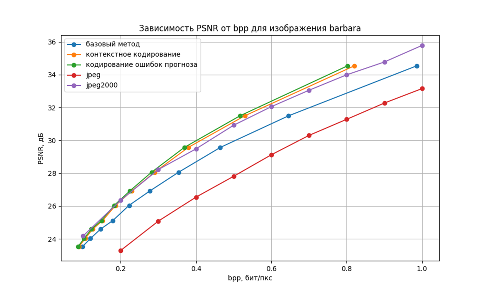
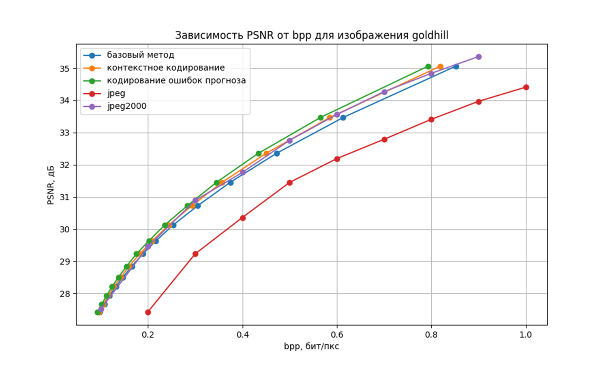
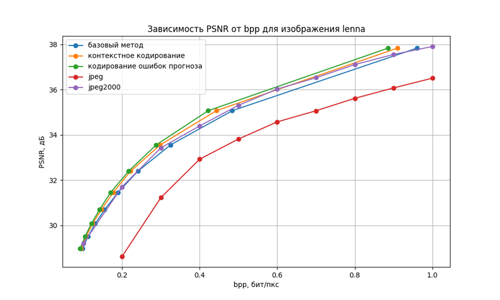
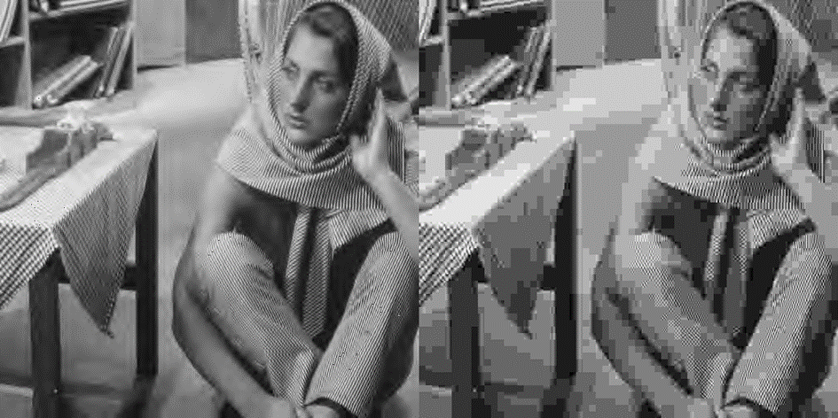

# WaveletCompression

Алгоритм сжатия изображений в области дискретного вейвлет-преобразования на основе машинного обучения

---

## Описание проекта  

Проект был реализован в рамках диссертационного исследования по направлению "Прикладная математика" НИУ МИЭТ.

В рамках проекта были реализованы различные модификации алгоритма сжатия в области дискретного вейвлет-преобразования (ДВП),
основанные на использовании статистических особенностей соседних элементов изображения.

Проект был реализован в три этапа:

1) Реализация базового многоуровневого кодирования ДВП-коэффициентов [1];
2) Реализация контекстного арифметического кодирования ДВП-коэффициентов [2];
3) Реализация контекстного арифметического кодирования ошибок регрессионного предсказания ДВП-коэффициентов с использованием машинного обучения.

Каждый из реализованных методов превосходит стандартные методы сжатия с потерями (*JPEG* и *JPEG-2000*), результирующий
алгоритм превосходит все предложенные методы сжатия (в среднем на 3% по сравнению с контекстными кодированием)

---

##  Результаты 

Пример реконструкции изображений (битрейт 0.25 бит/пкс):

---

##  Направления будущей работы (ToDo)

- *внедрение классификатора моделей сжатия*: текущая конфигурация алгоритма осуществляет поиск порогов прогноза для выбора моделей, осуществляемый итерационно на сетке значений. Поиск модели для каждого символа по принципу минимальной энтропии призван автоматизировать этот процесс и многократно сократить количество вычислений, 
- *имплементация арифметического кодирования на C++*: в ходе исследования было установлено, что реализация кодера на C++ с запуском из Python-программы за счет PyBind11 позволяет достичь не только большей производительности, то и повышения эффективности сжатия,
- *оптимизация текущей версии алгоритма*: очистка от повторяющихся частей кода, использование альтернативных моделей регрессии и пр.,
- *адаптация к практическому применению*: реализация сжатия цветных изображений произвольного размера (например, за счет поканального сжатия блоков изображения размером 512×512) 
---

## Требуемые зависимости 
- Python  
- Git
- pywt, pybind11, pandas, XgBoost, matplotlib 
- sklearn, PIL, OpenCV, JSON

## Важно

*Исходный код размещен в приватном репозитории. Для получения доступа следует обратиться по следующим контактам*:
- tg: *@vladimirrudnevskii*
- mail: *v.rud.frombts12@gmail.com*

[1] S. Umnyashkin, D. Koplovich, A. Pokrovskiy, A. Alexandrov. Image Compression Algorithm Based on Encoding of Tree-Arranged Wavelet Coefficients // Proc. of 3rd Russian-Bavarian Conference on Biomedical Engineering. Erlangen. – 2007. – pp. 121-126. 
[2] Умняшкин С. В. Вейвлет-компрессия цифровых изображений с прогнозированием статистических моделей //Известия вузов. Электроника. - №5. - 2001. - С.86-94.
